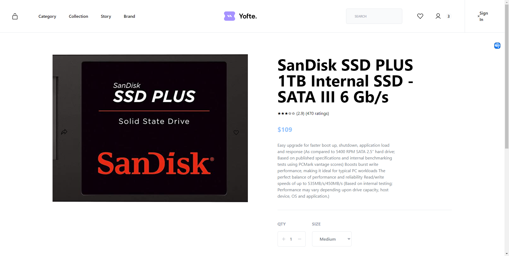

# Dioxus Example: An e-commerce site using the FakeStoreAPI

This example app is a fullstack web application leveraging the FakeStoreAPI and [Tailwind CSS](https://tailwindcss.com/).



# Development

1. Run the following commands to serve the application:

```bash
dx serve
```

Note that in Dioxus 0.7, the Tailwind watcher is initialized automatically if a `tailwind.css` file is find in your app's root.

# Performance TODOs

- [ ] Memoize home-directory filtering results in `src/components/home.rs` so search/filter changes avoid repeated lowercasing and full-list allocations on every render.
- [ ] Introduce drag update throttling in `src/components/directory.rs` (e.g. requestAnimationFrame batching) to reduce state writes during pointer movement.
- [ ] Add a fast slug index map in `src/stores.rs` for `get_store()` to avoid linear scans across all stores.

# Brand Images (Store Cards)

Store cards on the home page use logo images from `public/brands`.

- **Served path**: `/brands/<file>`
- **Source path in repo**: `public/brands/<file>`
- **Preferred format**: `.jpg` (existing legacy `.png` files are still used where present)

## Naming and Mapping Rules

- By default, store names are normalized into filenames (lowercase, separators to `_`, `.jpg` suffix).
- Some stores use explicit overrides in `src/components/home.rs` (for accented names, combined brands, or special naming).
- If a store image file is known to be missing, the app intentionally skips the image request and shows a text placeholder card instead.

## Adding New Store Logos

1. Add image files to `public/brands`.
2. If the store name does not map automatically, add an explicit override in `brand_image()` in `src/components/home.rs`.
3. If no image exists yet and you want to avoid 404 noise, add the store to the "known missing" list in `brand_image()` (returns `None`).

## Debugging Missing Logos

- Check server logs for `404 /brands/...` entries.
- Each 404 means the requested file is missing in `public/brands`.
- Once the file is added (or override corrected), the card will load the image; otherwise it falls back to the text placeholder.

# Status

This is a work in progress. The following features are currently implemented:

- [x] A homepage with a list of products dynamically fetched from the FakeStoreAPI (rendered using SSR)
- [x] A product detail page with details about a product (rendered using LiveView)
- [x] A cart page
- [x] A checkout page
- [x] A login page

---

## TODO List - Shopping Center Website (Client Requirements)

Based on the client specifications in `documentation/306-DEVA.pdf`, the following features need to be implemented for the FoxTown Shopping Center website:

### 🏪 Core Features

#### 1. Shop Directory & Information
- [ ] **Replace FakeStoreAPI with real shopping center data**
  - [x] Define `Store` / `Category` types with serde (see `src/stores.rs`)
  - [x] Embed all 160 FoxTown stores from `data/stores.json` (compile-time via `include_str!`)
  - [x] Categorize shops by type (High Fashion, Casualwear, Sportswear, Footwear, etc.)
  - [x] Expose Dioxus server functions: `get_stores()`, `get_stores_by_category()`, `get_stores_by_level()`
- [x] **Shop listing page** (`/map`)
  - [x] Display all shops with filtering by category, floor, name search
  - [x] Sort by name or floor
  - [x] Each card links to the shop detail page
- [x] **Shop detail page** (`/store/:name`)
  - [x] Individual page for each shop (name, category, floor, store number, phone)
  - [ ] Display location on shopping center map (TODO: interactive floor plan)
  - [x] Link to official website

#### 2. Interactive Game System 🎮
- [ ] **Design and implement a game for voucher prizes**
  - [ ] Choose game type (wheel of fortune, scratch card, slot machine, etc.)
  - [ ] Game logic implementation
- [x] **User authentication system** (`src/auth/`)
  - [x] User registration (`register` server fn)
  - [x] User login/logout (`login`, `logout` server fns)
  - [x] Session management (in-memory token store — TODO: persist to DB)
  - [ ] Implement Sign Up flow properly in the UI (validation, error states, and success path)
  - [ ] Implement Forgot Password flow properly (request reset + reset confirmation UX)
  - [ ] Add Google sign up / sign in integration
  - [ ] Add Apple sign up / sign in integration
- [ ] **Game rules implementation**
  - [ ] One game per day per user
  - [ ] Second chance if user loses first round
  - [ ] Maximum 10 prizes distributed per day
  - [ ] Prize distribution across different shops
- [ ] **Prize management**
  - [ ] Database for available vouchers
  - [ ] Prize redemption system
  - [ ] Admin interface to manage prizes

#### 3. Shopping Center Map 🗺️
- [ ] **Interactive map display**
  - [ ] Integrate the 4-level FoxTown map (Levels 0, 1, 2, 3)
  - [ ] Display all shop locations by floor
  - [ ] Search functionality to locate specific shops
  - [ ] Visual navigation (entrances, exits, facilities)
- [ ] **Map features**
  - [ ] Click on shop to see details
  - [ ] Filter by shop category
  - [ ] Show current location (if possible)

#### 4. Content Management System (CMS) 📝
- [ ] **Admin panel for collaborators** (UI not yet built)
  - [ ] Simple, user-friendly interface (no technical knowledge required)
  - [ ] WYSIWYG editor for content updates (TODO: wire up frontend editor, e.g. Quill/TipTap via JS interop)
- [x] **Editable content API** (`src/admin/` — see `ADMIN_API.md`)
  - [x] Shop information overlay (`upsert_shop_info`, `get_shop_info`)
  - [x] News and announcements (full CRUD: `create_news`, `list_news`, `update_news`, `delete_news`)
  - [x] Event management (full CRUD: `create_event`, `list_events`, `update_event`, `delete_event`)
  - [x] Banner/promotional content (full CRUD + `set_banner_active`, `list_all_banners`)
- [x] **User roles and permissions**
  - [x] Admin role (full access — can delete and manage users)
  - [x] Editor role (create/update content only)
  - [x] Authentication for admin area (`require_role` guard used in all admin server fns)

#### 5. Parking Information 🅿️
- [ ] **Parking availability display**
  - [ ] Real-time or regularly updated parking space counts
  - [ ] Multiple parking areas/zones
  - [ ] Visual indicators (full, available spaces, etc.)
- [ ] **Integration considerations**
  - [ ] API or data source for parking information
  - [ ] Update mechanism (manual or automated)

#### 6. Visitor Statistics 📊
- [ ] **Visitor tracking implementation**
  - [ ] Cookie-based or IP-based tracking (GDPR compliant)
  - [ ] Session tracking
  - [ ] Privacy policy integration
- [ ] **Statistics dashboard**
  - [ ] Daily visitor count
  - [ ] Monthly visitor count
  - [ ] Annual visitor count
  - [ ] Export functionality for reports
- [ ] **Admin analytics panel**
  - [ ] Charts and graphs
  - [ ] Date range filtering
  - [ ] Export to CSV/PDF

### 🎨 Additional Features

#### 7. General Website Features
- [ ] **Multi-language support** (French, Italian, English, German - for Swiss context)
- [ ] **Responsive design** for mobile, tablet, desktop
- [ ] **Accessibility** (WCAG compliance)
- [ ] **SEO optimization**
- [ ] **Cookie consent banner** (GDPR compliance)
- [ ] **Privacy policy page**
- [ ] **Terms and conditions page**
- [ ] **Contact page**
- [ ] **Events and promotions section**
- [ ] **Social media integration**
- [ ] **Newsletter subscription**

#### 8. Services & Amenities Information
- [ ] **Display information about**:
  - [ ] 9 bars and restaurants (from the plan)
  - [ ] Casino Admiral Mendrisio
  - [ ] The Sense Gallery
  - [ ] WiFi availability
  - [ ] Services (tailor, exchange office, tax refund, etc.)

### 📋 Project Management Requirements

Based on `documentation/Directives_v2.pdf`:

#### 9. Documentation (Deadline: May 1st, 2026)
- [ ] **Project planning documentation**
  - [ ] Planned schedule/timeline
  - [ ] Actual schedule (track deviations)
  - [ ] Budget breakdown
  - [ ] Feasibility study
  - [ ] Implementation phases
- [ ] **Individual documentation** (per team member)
  - [ ] Weekly work journals (due Thursday 17:00, PDF on Moodle)
  - [ ] Difficulties encountered
  - [ ] Improvements for future projects
- [ ] **Team documentation**
  - [ ] Weekly meeting minutes (procès-verbal, due Thursday 17:00, PDF on Moodle)
- [ ] **Client documentation**
  - [ ] User manual (for non-technical users)
  - [ ] Client description document
  - [ ] All client correspondence
  - [ ] Signed requirements document (cahier des charges)
  - [ ] Signed directives
- [ ] **Technical documentation**
  - [ ] Architecture documentation
  - [ ] Code documentation
  - [ ] Deployment guide
  - [ ] Maintenance guide
- [ ] **Presentation**
  - [ ] Final presentation to class
  - [ ] Demonstration of working application

### 🔧 Technical Infrastructure

#### 10. Technology Stack Decisions
- [ ] **Backend**
  - [ ] Database choice (PostgreSQL, SQLite, etc.)
  - [ ] API design and implementation
  - [ ] Server setup and deployment
- [ ] **Frontend**
  - [ ] Continue with Dioxus or consider alternatives
  - [ ] State management
  - [ ] Asset management
- [ ] **Hosting & Deployment**
  - [ ] Hosting provider selection (budget-conscious)
  - [ ] Domain name
  - [ ] SSL certificate
  - [ ] CI/CD pipeline
- [ ] **Third-party integrations**
  - [ ] Email service (for notifications)
  - [ ] Analytics (Google Analytics or alternative)
  - [ ] Parking API (if available)

### 📊 Progress Tracking

**Current Status**:
- Base Dioxus application structure ✅
- FakeStoreAPI integration (to be replaced) ⚠️
- SSR and routing implemented ✅
- Tailwind CSS styling ✅
- Store data types + server API (`src/stores.rs`) ✅

**Next Steps**:
1. Build shop listing page using `get_stores()` / `get_stores_by_category()`
2. Implement authentication system
3. Design and implement the game system
4. Integrate shopping center map

---

**Note**: This project requires a significant pivot from a generic e-commerce demo to a specific shopping center information and engagement platform. Priority should be given to core client requirements: shop directory, interactive game, map integration, and CMS functionality.

---

## 🔴 PRIORITY TODO - Exigences client (`documentation/306-DEVA.pdf`)

Liste separee et prioritaire basee sur le vrai cahier des charges client.

- [x] **Repertorier toutes les boutiques du centre**
  - [x] Donnees boutiques integrees
  - [x] Listing des boutiques avec filtres/recherche
- [x] **Ajouter un lien vers le site officiel de chaque magasin**
  - [x] Lien present sur la page detail magasin
- [ ] **Mettre un petit jeu en page d'accueil pour gagner des bons d'achat**
  - [ ] Choisir et implementer le jeu
  - [ ] Integrer le jeu sur la home
- [ ] **Appliquer les regles du jeu**
  - [ ] Compte utilisateur obligatoire pour participer
  - [ ] Limite a une participation par jour
  - [ ] Deuxieme chance si echec au premier tour
  - [ ] Limite de 10 cadeaux par jour
- [ ] **Afficher le plan du centre**
  - [ ] Carte interactive complete (niveaux, position des boutiques)
- [ ] **Permettre aux collaborateurs de faire des mises a jour facilement**
  - [ ] Interface admin simple (sans connaissances techniques)
- [ ] **Afficher le nombre de places disponibles dans les parkings**
  - [ ] Source de donnees + affichage des disponibilites
- [ ] **Enregistrer et exploiter les statistiques visiteurs**
  - [ ] Comptage visiteurs
  - [ ] Statistiques journalieres, mensuelles et annuelles
- [ ] **Respecter le budget serre et rester legal**
  - [x] Prioriser des solutions open source / faible cout
    - Stack retenue: Dioxus + Rust + Tailwind CSS (open source), hebergement Linux low-cost, SQLite pour demarrage puis migration PostgreSQL si necessaire.
    - Integrations payantes reportees tant qu'elles ne sont pas indispensables au MVP.
  - [ ] Verifier conformite legale (donnees, cookies, tracking)

